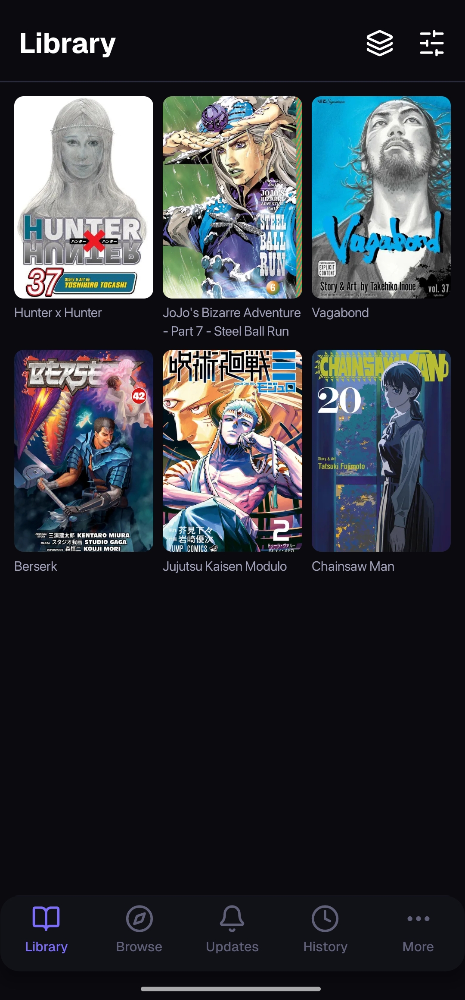
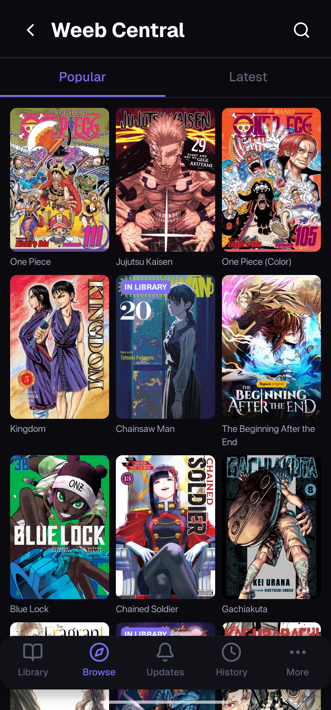
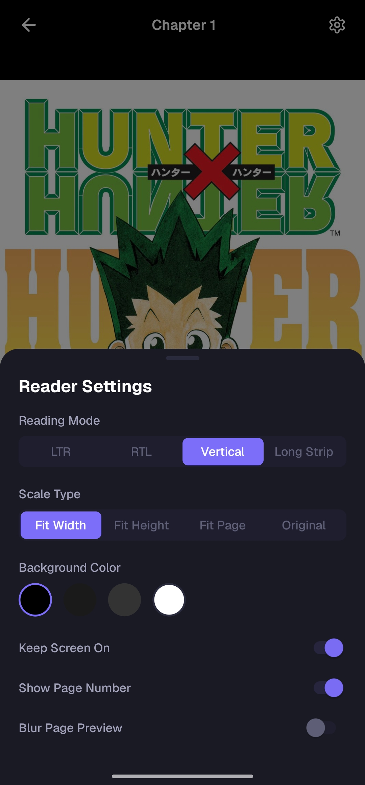
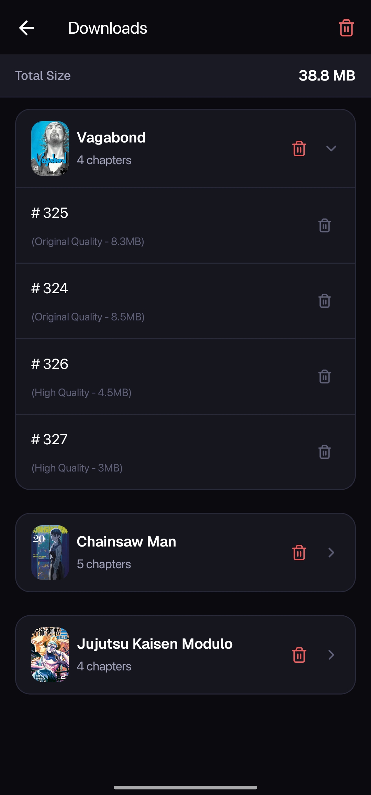
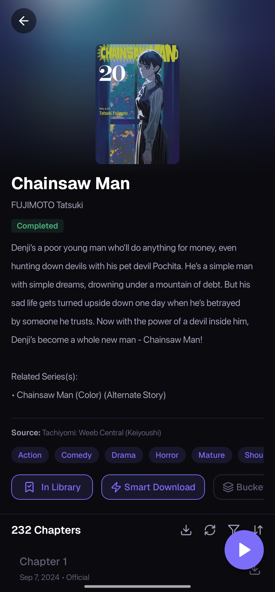

<div align="center">


# Atahon

**A modern manga reader for Android — Tachiyomi-compatible extensions, powerful reader, offline-first.**

[](https://github.com/diogorainhalopes/atahon/releases)
[](https://github.com/diogorainhalopes/atahon/releases)
[](https://expo.dev)
[](LICENSE)

[Download APK](https://github.com/diogorainhalopes/atahon/releases) · [Documentation](https://diogorainhalopes.github.io/atahon/docs/)

</div>

---

## Features

- **Tachiyomi / Mihon extension support** — Install community APK extensions and browse hundreds of sources
- **4 reading modes** — Webtoon scroll, left-to-right, right-to-left, vertical paged
- **13+ reader settings** — Scale type, page layout, preload count, background color, fullscreen, and more
- **Smart downloads** — Auto-queue new chapters, background processing, configurable concurrency
- **Chapter compression** — WebP conversion with adjustable quality slider to save storage
- **Library management** — Custom categories, color-coded reading status, progress tracking
- **History & resume** — Timestamp-based history, resumes exactly where you left off
- **Privacy mode** — Anonymous reading that disables history tracking
- **Offline-first** — Everything lives in a local SQLite database; no account, no cloud

## Screenshots

| Library | Browse | Reader | Downloads | Details |
|---------|--------|--------|-----------|---------|
|  |  |  |  |  |

## Tech Stack

| Layer | Technology |
|-------|-----------|
| Framework | Expo SDK 55 + React Native 0.83 (New Architecture) |
| Language | TypeScript 5 |
| Navigation | Expo Router (file-based) |
| Styling | NativeWind v4 + Tailwind CSS v3 |
| Animations | Reanimated 4 + Gesture Handler |
| Database | expo-sqlite + Drizzle ORM |
| State | Zustand v5 (persisted with AsyncStorage) |
| Data fetching | TanStack Query v5 |
| Extension bridge | Custom Kotlin Expo Module (`modules/extension-bridge`) |
| Build | EAS Build — direct APK distribution |

## Getting Started

### Requirements

- Node.js 20+
- JDK 21 (via SDKMAN or similar)
- Android device or emulator

### Setup

```sh
# Install dependencies and fix Expo version constraints
make setup

# Run on Android
make android
```

Or without Make:

```sh
npm install
npx expo run:android
```

### All Make targets

```
make setup        Install deps, fix Expo versions, check environment
make android      Build and run on Android
make ios          Build and run on iOS simulator
make release      Trigger EAS production build
make prebuild     Generate native project files (expo prebuild)
make lint         Run ESLint + TypeScript type check
make test         Run Jest test suite
make clean        Clear all caches, node_modules, and build artifacts
make update-deps  Fix Expo version constraints + show outdated packages
```

## Project Structure

```
app/                            Expo Router screens (file-based routing)
  (tabs)/
    library/                    Library grid
    browse/                     Source list + browse screen
    updates/                    New chapters feed
    history/                    Reading history
    more/                       Extensions, Downloads, Settings
  (modals)/                     Modal overlays
  manga/[mangaId]/
    index.tsx                   Manga detail screen
    reader/[chapterId].tsx      Reader screen
  extensions/                   Extension management
  downloads/                    Downloads screen
  settings/                     Settings screen

modules/
  extension-bridge/             Kotlin native module — loads Tachiyomi APK extensions
    src/index.ts                TS API wrapper (ExtensionBridge singleton)
    android/src/                Kotlin: ExtensionLoader, SourceCaller, NetworkHelper

src/
  db/
    schema.ts                   Drizzle ORM schema (7 tables)
    client.ts                   Database initialization + migrations
    migrations/                 Inline SQL migrations
    queries/                    DB query operations
  stores/                       Zustand state stores
    settingsStore.ts            User preferences + persistent settings
    readerStore.ts              Reader session + settings
    downloadStore.ts            Download queue (runtime)
    sourceStore.ts              Source/extension state
  queries/                      TanStack Query v5 hooks
    manga.ts, reader.ts, sources.ts, extensions.ts, downloads.ts, etc.
  components/                   Shared UI components
    Screen.tsx                  Base screen wrapper with padding/safe area
    PageHeader.tsx              Common header component
    Filter sheets, modals
  reader/                       Reader system
    viewers/                    Webtoon, LTR, RTL, vertical paged modes
    gestures/                   Touch handling
    overlay/                    Reader UI overlay
    zoom/                       Pinch-to-zoom logic
  types/
    extensions.ts               Tachiyomi/Mihon extension type contracts
  theme/                        Design tokens
    colors.ts, typography.ts, spacing.ts, index.ts
  utils/                        Helper utilities
    downloadPaths.ts, downloadWorker.ts, logger.ts
  hooks/                        Custom React hooks

docs/                           Astro documentation site
  src/pages/docs/               User-facing documentation
    index.mdx, extensions.mdx, compression.mdx, etc.
  src/screenshots/              Feature screenshots
```

### Import Path Aliases

All path aliases are defined in `tsconfig.json` and `babel.config.js`:

| Alias | Maps to |
|-------|---------|
| `@/*` | `src/*` |
| `@db/*` | `src/db/*` |
| `@stores/*` | `src/stores/*` |
| `@queries/*` | `src/queries/*` |
| `@components/*` | `src/components/*` |
| `@reader/*` | `src/reader/*` |
| `@utils/*` | `src/utils/*` |
| `@hooks/*` | `src/hooks/*` |
| `@theme/*` | `src/theme/*` |

## Architecture

### State Management

Atahon uses a layered state architecture:

1. **User Settings** — Persistent preferences stored via Zustand + AsyncStorage
   - `settingsStore.ts` — App-wide settings (theme, reader defaults, download options, etc.)
   - `readerStore.ts` — Reader session (current chapter, zoom, orientation, etc.)

2. **App Data** — Local SQLite database (Drizzle ORM)
   - 7 tables: `manga`, `chapter`, `history`, `category`, `manga_category`, `download_queue`, `extension_repo`
   - Migrations managed in `src/db/migrations/migrations.ts`
   - Timestamps are Unix seconds, not milliseconds

3. **Transient Runtime** — In-memory Zustand stores
   - `downloadStore.ts` — Download queue and progress tracking
   - Dual-tracked with database for persistence across restarts

4. **Async/Server State** — TanStack Query v5 hooks
   - `mangaKeys`, `downloadKeys`, `extensionKeys`, `sourceKeys`, `readerKeys`, `historyKeys`, `categoryKeys`
   - Automatic cache management and invalidation

### Reader System

The reader supports 4 viewing modes:
- **Webtoon** — Continuous vertical scroll
- **Left-to-Right (LTR)** — Page-by-page, classic left-to-right
- **Right-to-Left (RTL)** — Manga standard, right-to-left paging
- **Vertical Paged** — Vertical page-by-page navigation

Features include:
- Pinch-to-zoom with Reanimated 4 animations
- Customizable preloading (3-10 pages ahead)
- Page scaling (fit to width, fit to height, original)
- Fullscreen mode, brightness control
- Background color customization

### Downloads

- Files stored at `documentDirectory/manga/<mangaId>/<chapterId>/`
- Completion sentinel: `pages.json` written last (marks successful download)
- Worker pump respects `concurrentDownloads` setting
- Dual tracking: database (persistence) + Zustand store (runtime progress)
- Auto-queue new chapters from followed sources

### Chapter Compression

- Automatic WebP conversion with quality slider (30-95%)
- Storage savings typically 40-60% depending on source image quality
- Toggle compression on/off per-chapter or globally

## Extension Support

Atahon loads Mihon/Tachiyomi extension APKs natively via a custom Kotlin bridge module at `modules/extension-bridge/`. Extensions are stored privately on-device as `$packageName.ext` files and loaded with a `ChildFirstPathClassLoader` that matches Mihon's exact implementation, ensuring full ecosystem compatibility.

**Key Details:**
- Extensions are Tachiyomi-compatible APKs (lib version 1.4–1.5 enforced)
- Each extension is signature-verified via SHA-256 of APK signing certificates
- Loaded with ClassLoader that prioritizes extension code, falls back to host app for tachiyomi.* packages
- Files must be marked read-only before loading (Android 14+ requirement)
- `sourceId` is passed as `String` to avoid JavaScript precision loss with Long integers

**Default Extension Repository:** [Keiyoushi](https://raw.githubusercontent.com/keiyoushi/extensions/repo)

## Design System

- **Color scheme:** Dark theme with #0A0A0F base, optional AMOLED mode
- **Accent color:** #7C6EF8 (purple)
- **Fonts:** Geist (Regular, Bold) + Geist Mono via expo-google-fonts
- **Tokens:** NativeWind color tokens in `tailwind.config.js`
  - `background-*`, `surface-*`, `border-*`, `accent-*`, `text-*`, `status-*`

## Building for Release

Atahon uses [EAS Build](https://expo.dev/eas) for production APKs and distributes them directly — no Google Play.

```sh
make release
# or
eas build --platform android --profile production
```

## Development

### Environment Setup

1. **Node.js 20+** — Check with `node --version`
2. **JDK 21** — Recommended via [SDKMAN](https://sdkman.io/): `sdk install java 21.0.2-open`
   - JDK 17+ required for AGP 8.12 + Gradle 9.0
   - Check with `java --version`
3. **Android SDK** — Set `ANDROID_HOME` environment variable
4. **npm config** — Uses `legacy-peer-deps=true` for React 19 compatibility

### Development Workflow

```sh
# Initial setup
make setup

# Daily development
make android          # Build and run on device/emulator
make lint             # Check code quality
make test             # Run test suite

# When adding features
npm install           # If new deps added
npx expo prebuild     # If native code changes
npx expo start        # For rapid iteration
```

### Key Development Notes

- **Metro bundler** — Automatically included with Expo CLI
- **TypeScript** — Strict mode enabled; run `npx tsc --noEmit` to check types
- **ESLint** — Flat config in `eslint.config.mjs`
  - `@typescript-eslint/no-unused-vars`: warn (prefix with `_` to suppress)
  - `@typescript-eslint/no-explicit-any`: warn
  - `no-console`: warn (allow `console.warn` and `console.error`)
- **NativeWind/Babel** — `nativewind/babel` is a preset, not a plugin
  - Already includes `react-native-worklets/plugin` for Reanimated 4 compat
  - No separate `react-native-reanimated/plugin` needed
- **New Architecture** — React Native New Architecture is **enabled**
  - Hermes engine, bridgeless mode active
  - Reanimated 4.2 + react-native-worklets 0.7.2 peer dependency

### Database Migrations

Add new migrations to `src/db/migrations/migrations.ts`:
- Inline SQL (not drizzle-kit generated)
- Each migration is a timestamp + SQL function pair
- Timestamps must be Unix seconds: `Math.floor(Date.now() / 1000)`

### Adding New Pages/Screens

1. Create file in `app/` directory following Expo Router conventions
2. Wrap content with `<Screen>` component from `@components/Screen`
3. Use NativeWind `className` props for styling (not `style` objects)
4. Use path aliases (`@/*`, `@components/*`, etc.) for imports

### Debugging

- Console logs are available via `npx expo start` with Metro bundler
- Android device logs: `adb logcat`
- TypeScript errors prevent builds — run `make lint` early and often

## Known Constraints

- `android/` and `ios/` directories are gitignored and regenerated by `expo prebuild`
  - Do not edit them directly; modify Gradle configs in `app.json` or `android/` plugin hooks instead
- Tailwind CSS v3.4 only (not v4) — v4 has incompatibilities with NativeWind
- React 19 with legacy peer deps — some packages have outdated peer dependency declarations

## Contributing

Issues and pull requests are welcome!

- **Bug reports** — Include device info, Atahon version, and reproduction steps
- **Feature requests** — Discuss in issues before implementing large changes
- **Code contributions** — Ensure `make lint` passes and follow existing code style
  - Commit messages: use conventional commits (`feat:`, `fix:`, `docs:`, `refactor:`, etc.)

## License

MIT

## Disclaimer

Atahon is a community-driven project inspired by Mihon. Ensure you have legal rights to access manga content from installed sources. Respect copyright and manga creators' wishes.
